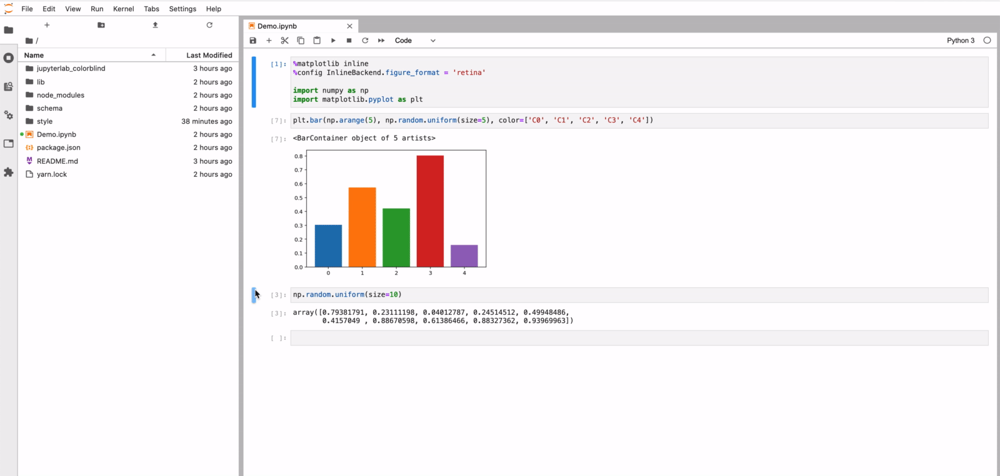

# jupyterlab_colorblind

Display plots with colorblindness simulation.



Once installed in JupyterLab, selecting a color-blindness mode under View -> Color-Blindness Simulation will transform all images to versions that simulate the type of color-blindness selected. Color-blindness affects a significant proportion of the population, making many data displays inaccessible to them. Almost 8\% of Caucasian males are affected by red-green color blindness, with females and other racial groups less affected (Machado, Oliveira, and Fernandes, 2009).

## Credits

The matrix color transformations come from Machado, Oliveira, and Fernandes, 2009, using the computed matrices [they posted on the companion website for the article](https://www.inf.ufrgs.br/~oliveira/pubs_files/CVD_Simulation/CVD_Simulation.html). All color-blindness simulations assume maximum severity of colorblindness. The idea to apply color-blindness filters using SVG filters in CSS comes from [RGBlind](https://www.rgblind.se/). The relative frequency of different types of color blindness is based on [Color Oracle](https://colororacle.org/).


## Prerequisites

* JupyterLab

## Installation

In JupyerLab, click on extensions in the left panel, then search for `@mattwigway/jupyterlab_colorblind`.

## Development

For a development install (requires npm version 4 or later), do the following in the repository directory:

```bash
# Clone the repo to your local environment
# Move to jupyterlab_colorblind directory
# Install dependencies
npm install
# Install your development version of the extension
jupyter labextension install .
```

You run JupyterLab in watch mode to watch for changes in the extension's source and automatically rebuild.

```bash
# Run jupyterlab in watch mode
jupyter lab --watch
```

Now every change will be built locally and bundled into JupyterLab. Be sure to refresh your browser page after saving file changes to reload the extension (note: you'll need to wait for webpack to finish, which can take 10s+ at times).

### Uninstall

```bash
jupyter labextension uninstall jupyterlab_colorblind
```

## References

Machado, G. M., Oliveira, M. M., & Fernandes, L. A. F. (2009). A Physiologically-based Model for Simulation of Color Vision Deficiency. IEEE Transactions on Visualization and Computer Graphics, 15(6), 1291–1298. https://doi.org/10.1109/TVCG.2009.113
